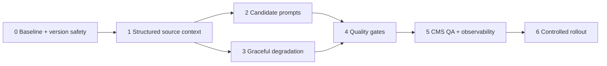

# Dichoithoi — Kế hoạch nâng chất lượng prompt và bài viết điểm đến

**Ngày ghi:** 29/07/2026  
**Trạng thái:** ĐÃ BUILD GIAI ĐOẠN 0-5 (29/07/2026); GIAI ĐOẠN 6 CHỜ REVIEW/ACTIVATE THỦ CÔNG  
**Bối cảnh:** audit đề xuất trong `gemini-analytic/gemini-analytic-result.md`, đối chiếu job thật
`abaa605a-c2e7-4244-b9a6-bb263f06edb7`, prompt active trong PostgreSQL, contracts, quality gates,
editor và renderer hiện hành. Mục tiêu là tăng giá trị lập kế hoạch chuyến đi và giảm nội dung
rập khuôn mà không bịa trải nghiệm, không nhồi từ khoá và không phá contract publish hiện tại.

## 1. Checklist SEO-owner trước khi thiết kế

1. **Hữu ích cho người đọc:** bài POI phải giúp quyết định có nên ghé, chuẩn bị gì, đi thế nào và
   rủi ro thực tế; bài Flagship phải giúp chọn khu, chia ngày và đi tiếp tới trang POI phù hợp.
   Không giữ section/list/FAQ chỉ để đủ số lượng nếu nguồn không có thông tin hữu ích.
2. **Cấu trúc SEO:** giữ một H1, H2 theo intent và nội dung thật; từ khoá chính xuất hiện tự nhiên
   ở H1, mở bài và meta description nhưng không ép một mẫu câu chung hoặc mật độ lặp. FAQ chỉ
   dùng cho câu hỏi bổ sung giá trị, không sao chép section. Trùng ý trên cùng URL là redundancy,
   không gọi là keyword cannibalization.
3. **Tín hiệu cần bổ sung:** Type, Tag, tỉnh/cụm cha, các điểm con đối với Flagship, provenance và
   độ tin cậy nguồn, cùng dữ liệu hành vi thật khi đã có đủ traffic. Không tự suy ra giá, giờ,
   sóng điện thoại, tháng đẹp nhất hoặc trải nghiệm ngôi thứ nhất khi nguồn không cung cấp.

Các nguyên tắc không thương lượng: không khôi phục `updateNotice`; không đổi ngày để tạo freshness
ảo; không dùng AI-detector làm gate; không viết như người đã tới nơi nếu không có input trải nghiệm
thật; mọi bài vẫn phải qua review con người trước publish.

### Trạng thái triển khai 29/07/2026

- Đã chọn **Mức B**: FAQ 0-6, structured list được rỗng, giữ bảy blockKey; renderer public hiện
  đã bỏ list/FAQ rỗng nên không cần sửa repo `dichoithoi` hay SQL Server.
- Đã build prompt version safety (candidate inactive, hash/diff, optimistic activation/rollback),
  structured writing context + provenance/missing flags, prompt Standard/Flagship mới và các warning
  `style`/`redundancy`/`grounding` không chặn approve.
- Đã thêm prompt/model/source/context-hash vào usage trace; warning dismiss được lưu append-only với
  reason và SHA-256 detail. Migration `AiUsagePromptTrace1782740000000` và
  `QualityWarningFeedback1782750000000` đã chạy local thành công.
- Đã thêm corpus 8 case, script baseline/candidate, rubric/rollout guide, prompt diff và warning
  dismiss trên hai review flow CMS. Full API: 78 suite/475 test pass; workspace typecheck và build
  web/API pass ngày 29/07/2026.
- Bốn candidate cuối đang **inactive**: Standard outline v4
  (`541b6eea...`), Standard content v3 (`61ef079d...`), Flagship outline v2 (`815d688f...`),
  Flagship content v3 (`3409a6f8...`). Active vẫn lần lượt v3/v2/v1/v2; không tự activate.
- Còn vận hành Giai đoạn 6: chạy provider thật trên corpus, blind review/chấm rubric, quyết định
  keep/rollback, activate batch nhỏ và theo dõi factual corrections/edit effort. Behavior metrics
  public vẫn là hạng mục riêng sau khi đủ traffic và có privacy/sample-size definition.

## 2. Hiện trạng đã audit

### 2.1 Luồng prompt và runtime

- [`prompt-builder.ts`](../../apps/api/src/modules/ai-content/application/services/prompt-builder.ts#L166-L179)
  ưu tiên prompt active trong DB trước `DEFAULT_PROMPTS`, chọn bộ Flagship
  trước bộ Standard theo `contentTier`. Vì vậy sửa default mà không tạo/activate version DB mới
  không làm thay đổi runtime.
- API local xác nhận ngày 29/07/2026: `guide-diem-den.content.vi` và
  `guide-diem-den-flagship.content.vi` đều đang dùng **DB version 2**, `source=db`, và
  `activeContent === defaultContent`.
- [`default-prompts.ts`](../../apps/api/src/modules/ai-content/application/services/default-prompts.ts#L335)
  hiện dùng hai lần gọi chính: outline rồi một content call sinh cả 7 sections
  và frame. Cách này cho model nhìn toàn bài để giảm lặp; không quay lại mặc định ba bước
  section/frame nếu chưa có benchmark chứng minh tốt hơn.
- Migration [`1782700000000-DestinationPromptRemoveUpdateNotice.ts`](../../apps/api/src/migrations/1782700000000-DestinationPromptRemoveUpdateNotice.ts#L20-L39)
  deactivate mọi version cũ rồi
  insert nguyên `DEFAULT_PROMPTS`. Cách migration này đạt mục tiêu bỏ `updateNotice`, nhưng có thể
  ghi đè lựa chọn active/customization vận hành. Đây là **lỗ hổng thật về quản trị prompt**.
- Job mẫu được tạo trước migration freshness nên response còn `updateNotice` và prompt/văn phong
  không đại diện đầy đủ cho runtime version 2. Dùng job này làm regression case về POI ít dịch vụ,
  không dùng như bản chụp duy nhất của prompt hiện tại.

### 2.2 Source context

- [`CreateDestinationJobUseCase.buildSourceContext()`](../../apps/api/src/modules/destination/application/use-cases/create-destination-job.usecase.ts#L223)
  hiện đưa tên, kind, slug, địa chỉ cũ/mới,
  toạ độ, liên hệ, điểm liên quan/gần nhất, nội dung cũ khi update, ghi chú admin, tóm tắt Skill/GSG
  và nội dung URL fetch được vào prompt.
- [`DestinationMirrorEntity`](../../apps/api/src/modules/destination/infrastructure/entities/destination-mirror.entity.ts#L33-L39)
  đã có `types`, `tags`, `parentSlug`, `provinceCode`; vì vậy bước đầu có
  thể enrich context mà không migration DB. Tuy nhiên `buildSourceContext()` chưa đưa trực tiếp
  taxonomy, tên cha/tỉnh và provenance theo field vào prompt. Đây là **lỗ hổng thật**.
- Summary Skill và GSG đã được phân biệt nguồn, nhưng chưa có ma trận field → nguồn → confidence.
  GSG structured output hiện không luôn có grounding chunks, nên không được mô tả là đã xác minh
  ngang nguồn đọc trực tiếp.

### 2.3 Contract, gate, editor và publish

- [`destination-article.ts`](../../packages/contracts/src/dichoithoi/destination-article.ts#L59-L70)
  buộc frame có 3-6 FAQ; cùng file buộc outline đúng 7 heading và `DESTINATION_SECTION_ORDER`
  buộc 7 blockKey.
- [`ContentSection.content`](../../packages/contracts/src/ai-content/article.ts#L56-L65) bắt buộc
  tối thiểu 50 ký tự.
- `trai-nghiem`, `an-gi`, `qua-mang-ve` là structured list; `MIN_LIST_ITEMS = 3`. Gemini V3 đề xuất
  list-only hoặc một item không hợp lệ với contract/gate hiện tại.
- [`destination-gates.ts`](../../apps/api/src/modules/ai-content/domain/quality-gates/destination-gates.ts)
  hiện chặn dưới 60 từ/section prose và dưới 800 từ toàn bài. Prompt lại yêu
  cầu 120-250 từ cho từng section. Các ngưỡng cứng này khuyến khích kéo dài nội dung dù nguồn mỏng,
  mâu thuẫn với nguyên tắc people-first “không viết theo số từ vì SEO”. Đây là **lỗ hổng thật**.
- SEO gate chỉ cần keyword có ở H1, intro, meta description; không đòi 10 từ đầu hoặc 100 ký tự đầu.
  Job Thác Triệu Hải fail vì intro dùng tên thay thế “thác Đakala” mà không có tên chính.
- Policy gate mới chặn một số claim tuyệt đối. Chưa có check cliché, repetition chéo field hoặc
  câu chữ không được nguồn hỗ trợ.
- Originality gate so sánh trigram với bài khác cùng tỉnh đã tồn tại và là warning. Đề xuất “thêm
  originality gate” của tài liệu Gemini là **lệch tài liệu, không phải việc chưa build**.
- Editor hỗ trợ list rỗng ở trạng thái nháp; [`destination-publish-html.renderer.ts`](../../apps/api/src/modules/destination/application/services/destination-publish-html.renderer.ts#L13-L29)
  chỉ render bullet khi `items.length > 0`.
  Vì vậy website không bắt buộc list phải có item, nhưng contract/gate đang chặn approve. Đây là
  điểm mở kỹ thuật để graceful degradation mà không cần đổi HTML public.

### 2.4 Phân loại đề xuất Gemini

| Nhóm            | Kết luận audit                                                                                                                                                                                                                       |
| --------------- | ------------------------------------------------------------------------------------------------------------------------------------------------------------------------------------------------------------------------------------ |
| **Nhận**        | Tách strategy POI/Flagship; enrich taxonomy/parent/source; phân vai intro/quickFacts/sections/FAQ; anti-cliché; graceful degradation; benchmark trên corpus thật.                                                                    |
| **Nhận có sửa** | Đặt keyword sớm nhưng tự nhiên, không template 10 từ đầu; quickFacts theo giới hạn từng field, không đồng loạt `<10 từ`; FAQ kiểm tra trùng ý, không gọi cannibalization; conversion bridge chỉ khi có sản phẩm/điểm liên quan thật. |
| **Bác**         | Khôi phục `updateNotice`; persona giả đã trải nghiệm; list một item đưa thẳng vào schema hiện tại; đổi 7 section thành 5-6 ngay; bắt buộc dữ liệu chưa có nguồn như sóng điện thoại/tháng đẹp nhất; dùng nguyên schema Prompt V3.    |
| **Đã có**       | POI/Flagship prompt keys; một content call; source-bound numeric facts; originality warning; review con người; freshness động.                                                                                                       |

## 3. Danh mục vấn đề cần sửa

### P0 — Có thể mất cải tiến prompt khi migration

Migration nghiệp vụ đang thay active content bằng default mới thay vì patch có điều kiện. Mỗi lần
sửa một field nhỏ có thể vô tình xoá customization đã được review trong DB.

**Hướng sửa:** bổ sung cơ chế rollout prompt bất biến: đọc active version, tạo version mới từ nội
dung mục tiêu đã review, ghi metadata/lý do thay đổi, không activate nếu active đã diverge mà chưa
có quyết định. Có preview/diff trước activate và rollback về version trước. Migration schema không
được âm thầm quyết định prompt vận hành.

### P0 — Context thiếu taxonomy, hierarchy và độ tin cậy

Model chưa biết rõ POI là thác hoang sơ, di tích, khu vui chơi hay điểm thương mại; cũng không nhận
đủ tên cụm/tỉnh cha để chọn intent và liên kết nội bộ. Nguồn có độ tin cậy khác nhau bị đưa vào một
khối text dài nên model khó phân biệt fact chắc chắn với gợi ý cần kiểm tra.

**Hướng sửa:** dựng `DestinationWritingContext` có các nhóm rõ ràng: identity/hierarchy, taxonomy,
verified facts, editorial notes, related entities, source summaries và missing-data flags. Hiển thị
slug + label tiếng Việt cho Type/Tag; resolve tên parent/province qua port/repository hiện có hoặc
batch lookup, không để model tự đoán từ slug.

### P0 — Contract ép AI tạo nội dung không có dữ liệu

Ba list × tối thiểu ba item, FAQ tối thiểu ba và 800 từ toàn bài khiến POI mỏng phải sinh “tự mang
nước”, “đồ ăn nhẹ”, “quà lưu niệm chung” để pass. Đây là nguồn thin content/rập khuôn trực tiếp.

**Khuyến nghị chọn Mức B; quyết định cuối trước khi code Phase 3:**

- **Mức A — tương thích tối đa:** giữ 7 section và 3 item, nhưng prompt yêu cầu item mang tính chuẩn
  bị/điều kiện thực tế có nguồn; nếu thiếu dữ liệu, tạo warning buộc biên tập bổ sung hoặc bỏ publish.
  Ít code nhưng chưa giải quyết gốc việc ép đủ 3.
- **Mức B — thích ứng theo dữ liệu (khuyến nghị):** giữ 7 blockKey/order để điều hướng ổn định,
  cho list section có `items=[]`, và cho FAQ 0-6. Section thiếu dữ liệu vẫn có thể chứa một đoạn
  ngắn, trung thực như “khu vực chưa có dịch vụ ăn uống; nên chuẩn bị trước”, hoặc được ẩn khỏi
  body/TOC nếu không có giá trị. Gate đánh giá block theo loại và nguồn thay vì số lượng đồng loạt.
  Cần đổi contracts, gate, skeleton/editor/preview/tests; renderer public hiện đã chịu list rỗng,
  nhưng phải verify website/TOC với section rỗng hoặc bị lược bỏ.

Không chọn phương án “một item placeholder”: nó chỉ đổi con số nhưng vẫn sản xuất content cho đủ.

### P1 — Prompt chưa phân vai đủ chặt và chưa tự kiểm cuối output

Prompt đã nói tránh lặp nhưng chưa yêu cầu model lập bản đồ fact → nơi trình bày chính và tự rà lại
trước khi trả structured output. `quickFacts` vẫn có thể thành prose dài; FAQ lặp lại H2; intro dễ
dùng câu hook chung chung.

**Hướng sửa:** prompt V3-compatible (không phải schema V3 của Gemini):

- POI: ưu tiên quyết định ghé thăm, đường tiếp cận, thời lượng, chi phí/dịch vụ, an toàn và chuẩn bị.
- Flagship: ưu tiên chọn khu, mùa, số ngày, lịch trình, điểm con và liên kết điều hướng.
- Intro: nêu tên chính tự nhiên trong câu đầu hoặc hai câu đầu, định vị giá trị/giới hạn cụ thể;
  không kể lại `tong-quan` và không dùng tên thay thế thay cho tên chính.
- Quick facts: answer-first; limit theo ký tự/field; giá/giờ lấy structured data; “Chưa có dữ liệu
  đã xác minh” tốt hơn suy diễn.
- FAQ: chỉ hỏi phần bổ sung hoặc answer nhanh cho intent quan trọng; không sao chép nguyên câu từ
  quickFacts/section. Nếu Mức B được chọn, không ép đủ 3 khi không có câu hỏi giá trị.
- Thêm checklist nội bộ trước output: đủ dữ liệu nguồn, không claim first-hand, không lặp fact dài,
  không cliché, không tự tạo CTA/điểm liên quan.

### P1 — Gate từ khoá, độ dài, cliché và repetition chưa đúng mục tiêu

- Giữ exact primary name trong H1/intro/meta description, nhưng prompt ưu tiên vị trí sớm tự nhiên;
  gate không áp hard “10 từ đầu” cho mọi bài.
- Thay total 800 words và 120-250 từ/section bằng yêu cầu theo utility/block. Ngưỡng schema tối
  thiểu chỉ bảo vệ output rỗng, không dùng như mục tiêu SEO.
- Cliché detector là warning dựa trên cụm/structure có độ chính xác cao; không cấm tính từ đơn lẻ.
  Ví dụ kiểm tra: “Nếu bạn đang tìm kiếm...”, “điểm đến không thể bỏ qua”, mở bài thay tên nhưng
  cùng cấu trúc. Cho phép reviewer dismiss warning có lý do.
- Repetition detector chuẩn hoá câu/đoạn và so intro, quickFacts, sections, FAQ. Exact/near-exact
  overlap dài là warning; lặp tên riêng hoặc fact ngắn như giá vé không phải lỗi tự động.
- Source-grounding gate trước mắt chỉ kiểm tra số/giá/giờ/địa chỉ xuất hiện trong context; không
  tuyên bố xác minh ngữ nghĩa toàn bài khi chưa có provenance field-level.

### P1 — Heading chưa bám intent và taxonomy

Outline hiện cho phép heading hoa mỹ dù blockKey đúng. Prompt phải dùng taxonomy/kind để chọn wording:
POI hỏi “ở đâu/có gì/cách đi”; Flagship hỏi “đi đâu/mấy ngày/khu nào”. Gate chỉ cần bắt blockKey/order
và heading không rỗng; không biến một danh sách heading mẫu thành doorway template toàn site.

### P2 — Thiếu QA corpus, observability và feedback loop

Chưa có bộ case đại diện để so prompt version, chưa lưu rubric review theo dimension và chưa có cách
biết warning nào hữu ích. Chưa nên tuyên bố A/B theo CTR nếu traffic/instrumentation không đủ.

**Hướng sửa:** corpus cố định tối thiểu 8 điểm: POI thương mại đủ dữ liệu, POI thiên nhiên hẻo lánh,
POI văn hoá/di tích, POI đô thị, POI miễn phí, POI thiếu nguồn, Flagship tỉnh và Flagship cluster.
Lưu prompt version/model/source snapshot/gate result/cost. Human rubric 1-5 cho usefulness, grounding,
redundancy, scanability, voice và edit effort. Chỉ dùng behavior metrics sau khi định nghĩa event,
privacy, sample size và thời gian đo.

## 4. Kế hoạch triển khai theo giai đoạn

### Giai đoạn 0 — Đóng băng baseline và bảo vệ prompt version

**Phạm vi repo:** chỉ `zinoflow`; không đổi public schema/render.  
**Phụ thuộc:** độc lập, làm trước mọi sửa prompt.

**Việc làm:**

1. Export active outline/content versions cho Standard/Flagship và ghi hash; lấy cả default để diff.
2. Tạo corpus 8 case và lưu expected missing-data profile, không lưu secret/raw copyrighted page.
3. Viết regression test cho prompt resolver: DB active thắng default; Standard/Flagship đúng key.
4. Thiết kế activation service/command có diff, optimistic check active version và rollback.
5. Sửa pattern migration prompt: nếu active diverge thì fail rõ hoặc tạo inactive candidate để
   review; không deactivate/overwrite âm thầm.
6. Xác định owner và log `promptVersion`/template key trong usage hiện có để truy vết mỗi output.

**DoD:**

- Query DB xác nhận version/hash baseline và rollback khôi phục đúng version trước.
- Test mô phỏng active customized chứng minh migration/rollout không mất nội dung.
- Chạy lại job test bằng cùng version/model cho output baseline; lưu gate/cost/rubric, không publish.

### Giai đoạn 1 — Source context có cấu trúc

**Phạm vi repo:** chỉ `zinoflow`; dự kiến không migration DB vì mirror đã có taxonomy/hierarchy.  
**Phụ thuộc:** Giai đoạn 0 để output truy vết được prompt/context version.

**Việc làm:**

1. Tách pure builder cho writing context; thêm Type/Tag, kind/tier, parent/province có tên hiển thị,
   related children/POI và missing-data flags.
2. Gắn source label + confidence policy: database/admin approved > fetched direct source > Skill
   summary > GSG unverified. Không biến confidence thành phần trăm giả.
3. Giới hạn/ưu tiên context theo token; structured facts ở trước, raw fetched text ở sau; chống
   prompt injection trong nội dung nguồn ngoài bằng delimiter và instruction rõ.
4. Thêm test snapshot/semantic assertions cho POI Thác Triệu Hải và một Flagship có điểm con.

**DoD:**

- Preview prompt cho case POI hiện đúng Type/Tag, tên cụm/tỉnh và đánh dấu phần thiếu ăn/quà.
- Flagship nhận đúng children, không dùng giá/giờ của một POI làm quick facts toàn vùng.
- Test chứng minh URL/source text không thể đổi system instruction và context không vượt budget.

### Giai đoạn 2 — Prompt Standard/Flagship mới, tương thích contract hiện tại

**Phạm vi repo:** chỉ `zinoflow`.  
**Phụ thuộc:** Giai đoạn 1; có thể làm song song code gate Phase 4 sau khi chốt rubric.

**Việc làm:**

1. Viết candidate prompts riêng cho outline/content Standard và Flagship theo mục 3.
2. Giữ 7 block keys, field names và không có `updateNotice`; chưa đổi min FAQ/list ở phase này.
3. Bỏ yêu cầu “như người đi thực tế kể lại”; thay bằng giọng biên tập am hiểu, cụ thể, không giả
   first-hand. Thêm anti-cliché và tự rà repetition/source trước output.
4. Version candidate ở trạng thái inactive, chạy corpus với model production và ít nhất một model
   dự phòng; human blind review baseline/candidate.

**DoD:**

- 8/8 outputs parse đúng contract hiện tại; không có `updateNotice` hoặc claim first-hand vô nguồn.
- Case Thác Triệu Hải có tên chính trong intro tự nhiên và không mở bằng mẫu “Nếu bạn đang...”.
- Candidate giảm redundancy/edit effort theo rubric, không tăng hallucination; người dùng duyệt diff
  rồi mới activate.

### Giai đoạn 3 — Chốt và triển khai graceful degradation

**Phạm vi repo:** `zinoflow`; `dichoithoi` chỉ cần sửa nếu quyết định ẩn cả section/TOC không được
renderer hiện tại hỗ trợ. Không cần đổi SQL Server chỉ để cho `items=[]`.  
**Phụ thuộc:** Giai đoạn 1 để biết dữ liệu nào thực sự thiếu; cần người dùng chốt Mức A/B.

**Việc làm nếu chọn Mức B (khuyến nghị):**

1. Đổi contract FAQ thành 0-6 và list items thành 0+; vẫn giữ object fields rõ ràng.
2. Phân loại section `substantive`, `availability-note`, `omitted`; ưu tiên không thêm field mới nếu
   có thể suy ra an toàn từ content/items, nhưng không dùng string magic phân loại tiếng Việt.
3. Gate theo block: trải nghiệm cần hành động có nguồn; ăn/quà được list rỗng khi context đánh dấu
   thiếu; đoạn availability ngắn không bị total-word gate phạt.
4. Editor hiển thị rõ “không có dữ liệu xác minh”, cho reviewer thêm/xoá items; FeatureIntro/help
   giải thích cơ chế ngay panel theo quy tắc CMS.
5. Verify preview/publish/TOC/mobile cho list rỗng và FAQ rỗng. Nếu website đang render heading trống
   hoặc JSON-LD FAQPage rỗng, sửa tối thiểu ở repo `dichoithoi` trong phase này.

**DoD:**

- Thác Triệu Hải không còn ba item giả cho ăn/quà nhưng vẫn trả lời rõ cần chuẩn bị gì.
- POI thương mại đủ dữ liệu vẫn có list scan được; Flagship vẫn có đặc sản vùng khi nguồn đủ.
- Contract, API, editor, preview, publish và .NET page render pass với 0/1/3+ items và 0/3+ FAQ.
- `FAQPage` chỉ xuất khi FAQ hiển thị thật; không có section/TOC rỗng trên desktop/mobile.

### Giai đoạn 4 — Quality gates hướng giá trị

**Phạm vi repo:** chỉ `zinoflow`.  
**Phụ thuộc:** Giai đoạn 2; nếu đổi cardinality thì phụ thuộc thêm Giai đoạn 3.

**Việc làm:**

1. Refactor length gate theo loại block; bỏ 800 words như hard SEO target.
2. Bổ sung warning `style` và `redundancy`; giữ severity warning đến khi đo false positive.
3. Giữ keyword gate ở H1/intro/meta, cải thiện detail chỉ ra vị trí thiếu; không hard-code mật độ.
4. Bổ sung numeric grounding checks dựa trên structured context/provenance.
5. Giữ originality warning hiện có; không tạo gate trùng chức năng và không dùng AI-detector.

**DoD:**

- Unit tests có true/false positives: cliché, near-duplicate, giá lặp hợp lệ, tên riêng lặp hợp lệ,
  alias không thay primary name, number có/không có nguồn.
- Bài ngắn nhưng đủ utility pass; bài 800+ từ rập khuôn vẫn phát warning.
- UI phân biệt error chặn approve với warning cần review/dismiss; lý do dismiss được audit.

### Giai đoạn 5 — CMS QA và observability

**Phạm vi repo:** chỉ `zinoflow`.  
**Phụ thuộc:** Giai đoạn 4.

**Việc làm:**

1. Trên trang job/editor, hiển thị FeatureIntro ngắn về vai trò source, gate và review con người.
2. Cho reviewer xem prompt version/model, source coverage, warning theo field và đoạn bị trùng;
   không phơi raw secret hoặc toàn bộ system prompt cho role không phù hợp.
3. Ghi rubric/edit effort và diff AI→approved; thêm aggregation theo prompt version.
4. Không tự publish khi score cao; review người vẫn là gate bắt buộc.

**DoD:**

- Reviewer hiểu warning ở đâu và sửa/dismiss được không cần đọc docs.
- Một job truy vết được prompt version, model, source snapshot, gates và final edits.
- `tsc`, Jest phạm vi AI/destination/web pass; Playwright kiểm tra desktop/mobile không overlap.

### Giai đoạn 6 — Rollout có kiểm soát và đo lường

**Phạm vi repo:** `zinoflow`; instrumentation public ở `dichoithoi` là hạng mục riêng chỉ làm khi
chọn đo behavior metrics.  
**Phụ thuộc:** Giai đoạn 0-5.

**Việc làm:**

1. Activate candidate cho batch nhỏ đại diện, review 100%, không publish hàng loạt tự động.
2. So sánh baseline/candidate: gate pass, hallucination, edit effort, redundancy, cost/latency.
3. Rollback nếu factual error hoặc edit effort tăng; version tiếp theo chỉ đổi một nhóm giả thuyết.
4. Sau khi có traffic đủ mới cân nhắc event scroll/CTA/internal-link; định nghĩa privacy/sample size
   trước, không kết luận từ vài page view.

**DoD:**

- Có báo cáo corpus + batch thật và quyết định keep/rollback có bằng chứng.
- Không tăng tỷ lệ factual correction; edit effort và redundancy cải thiện theo ngưỡng chốt trước.
- Prompt active có changelog, rollback đã thử; không còn job không truy ra version.

## 5. Thứ tự phụ thuộc

Giai đoạn 2 có thể benchmark prompt tương thích cũ trước khi chốt Mức B. Tuy nhiên không activate
rộng trước Giai đoạn 4-5 vì prompt-only đã được chứng minh là không đủ tin cậy.

## 6. Kiểm thử bắt buộc toàn plan

- **Unit/contracts:** context builder, resolver/version activation, Standard/Flagship selection,
  adaptive list/FAQ, style/redundancy/grounding gates.
- **Integration:** structured-output parse với provider thật trên corpus; persistence và rollback
  prompt version; preview/publish round-trip.
- **Regression job thật:** Thác Triệu Hải; thêm ít nhất một POI đủ dịch vụ và một Flagship.
- **Public page nếu Phase 3 chạm `dichoithoi`:** `dotnet build`, Playwright desktop/mobile, HTML
  server-render, TOC, FAQ JSON-LD, section/list rỗng, console errors và Core Web Vitals smoke.
- **SEO review người:** Who/How/Why; không fake experience, date spam, keyword stuffing, unsupported
  hard facts hoặc các bài chỉ đổi tên địa điểm trên cùng khuôn.

## 7. Non-goals

- Không thay toàn bộ bảy block bằng cấu trúc tự do trong đợt này.
- Không khôi phục `updateNotice` hoặc thay freshness động.
- Không thêm review/rating giả hay schema từ nội dung AI.
- Không tự động publish hoặc bỏ review người.
- Không tối ưu để “qua AI detector”.
- Không hứa tăng ranking/CTR trước khi có dữ liệu đủ và attribution hợp lý.

## 8. Quyết định cần người dùng chốt trước Giai đoạn 3

1. Chọn **Mức A** (ít thay đổi, còn ép đủ list) hay **Mức B** (khuyến nghị, contract thích ứng theo
   dữ liệu và có thể cần verify/sửa renderer public).
2. Với section không có dữ liệu: hiển thị availability note ngắn hay ẩn hẳn section khỏi body/TOC.
   Khuyến nghị hiển thị note khi nó trả lời câu hỏi quan trọng (“không có dịch vụ ăn uống”), ẩn khi
   chỉ tạo ra placeholder không thêm giá trị (“chưa rõ quà mang về”).
3. Warning style/redundancy có cho dismiss kèm lý do hay chỉ dùng như gợi ý không lưu trạng thái.
   Khuyến nghị lưu dismiss reason để đo false positive trước khi nâng bất kỳ rule nào thành error.
